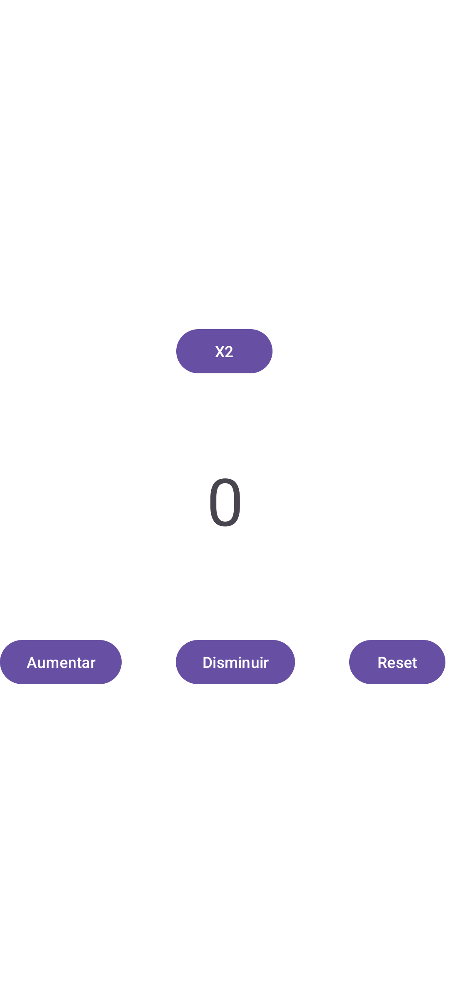
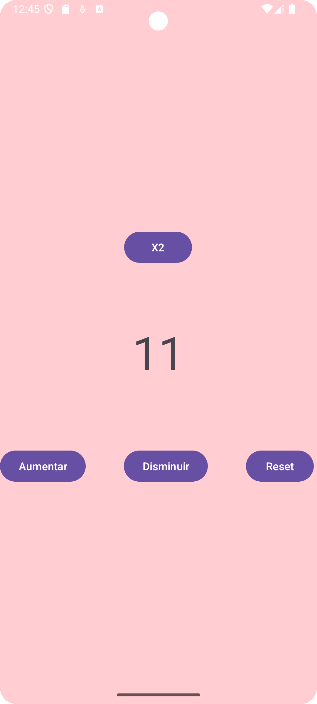

## Autor
**Mauricio Bolívar A.**

# Contador Inteligente

Mini proyecto Android en **Java** para practicar:
- Eventos con botones
- Uso de `SharedPreferences` para guardar datos
- Cambio dinámico de interfaz (`ConstraintLayout`)

## Funcionalidades
1. Incrementar y decrementar el contador.
2. Reiniciar el contador a cero.
3. Guardar el valor del contador aunque cierres la app.
4. Cambio de color de fondo cuando el contador supera 10.

## Capturas de pantalla



## Tecnologías usadas
- Android Studio
- Java
- SharedPreferences
- ConstraintLayout

## Cómo probarlo
1. Clonar el repositorio:
   ```bash
   git clone https://github.com/TU-USUARIO/ContadorInteligente.git
